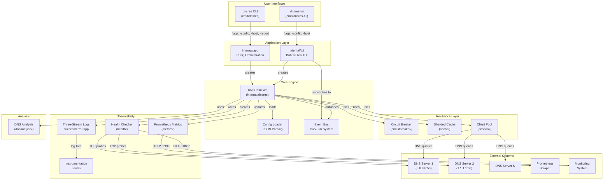
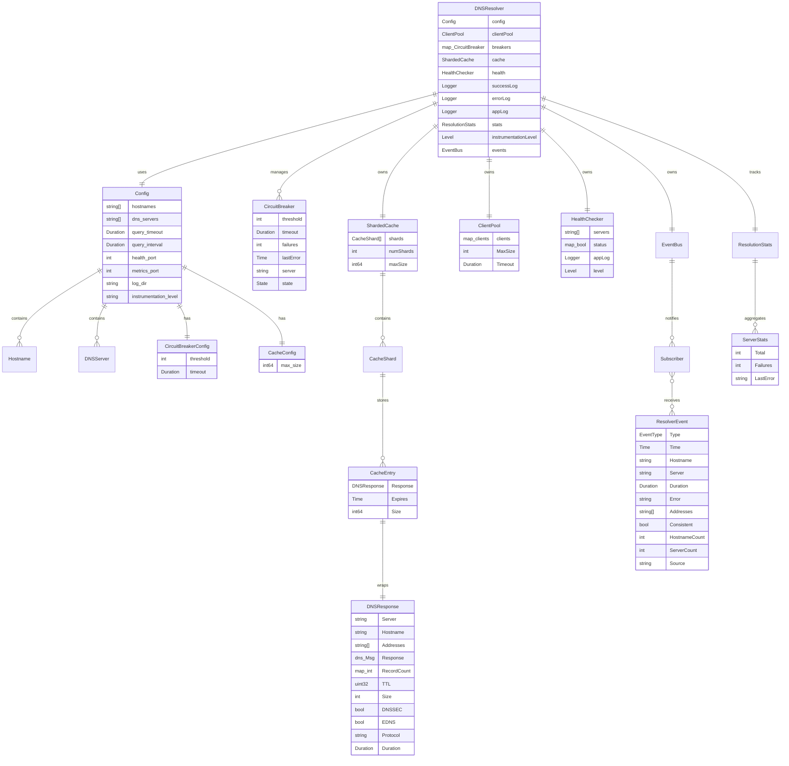
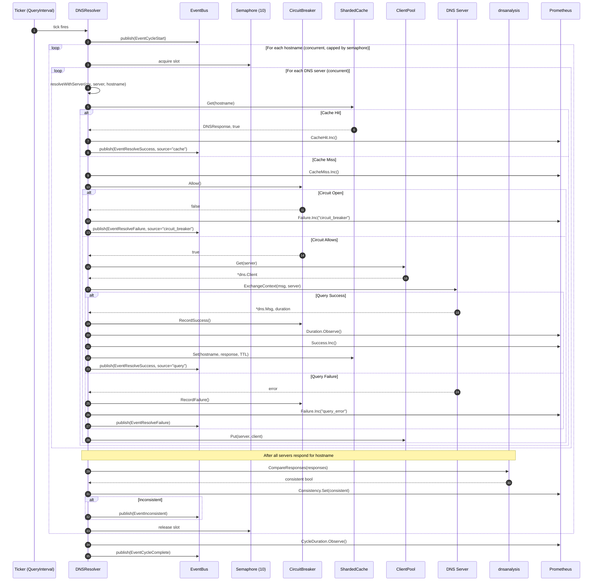
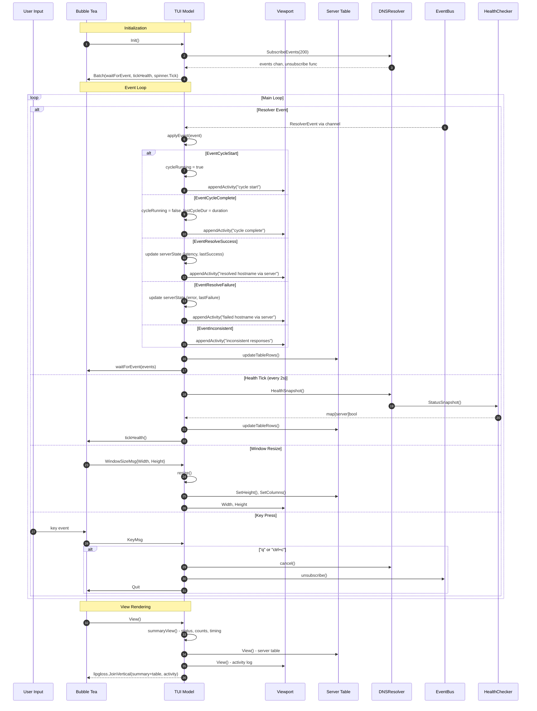
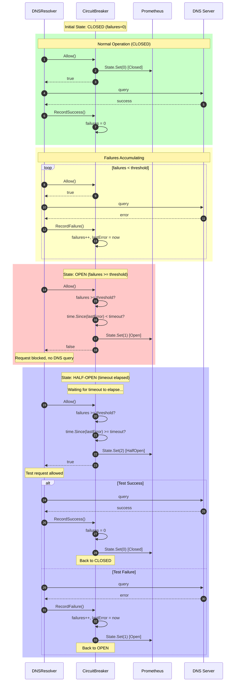
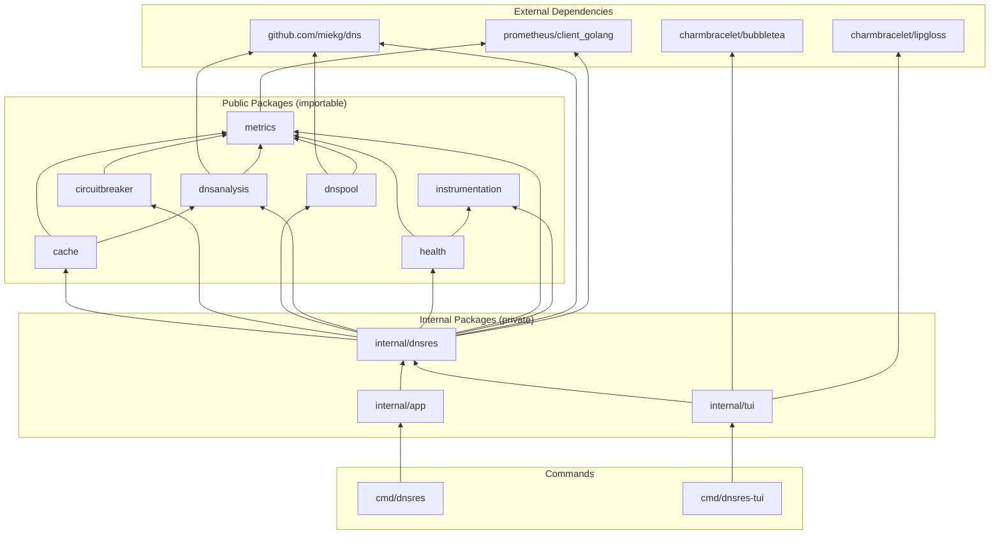

# PROJECT_MAP.md - DNS Resolution Monitor Architecture

> **Long-Term Memory** for AI agents and developers working on this codebase.
> 
> Last Updated: 2026-02-02 | Go 1.24.0 | ~3,700 LOC

---

## Table of Contents
1. [High-Level Architecture](#section-1-high-level-architecture)
2. [Data Models](#section-2-data-models)
3. [Core Critical Flows](#section-3-core-critical-flows)
4. [Directory Map](#section-4-directory-map)
5. [Quick Reference](#quick-reference)

---

## Section 1: High-Level Architecture

### System Overview (10,000ft View)

The DNS Resolution Monitor is a long-running process that periodically resolves configured hostnames against multiple DNS servers, tracks consistency, exposes metrics, and provides both CLI and TUI interfaces.



### Component Interaction Matrix

| From \ To | Resolver | Cache | CircuitBreaker | Pool | Metrics | Events |
|-----------|----------|-------|----------------|------|---------|--------|
| **Resolver** | - | Get/Set | Allow/Record | Get/Put | Update | Publish |
| **Cache** | - | - | - | - | Update | - |
| **CircuitBreaker** | - | - | - | - | Update | - |
| **Pool** | - | - | - | - | Update | - |
| **Health** | - | - | - | - | Update | - |
| **TUI** | HealthSnapshot | - | - | - | - | Subscribe |

---

## Section 2: Data Models

### Entity-Relationship Diagram



### Event Types

| EventType | Trigger | Key Fields |
|-----------|---------|------------|
| `cycle_start` | Resolution cycle begins | HostnameCount, ServerCount |
| `cycle_complete` | Resolution cycle ends | Duration, HostnameCount, ServerCount |
| `resolve_success` | Single resolution succeeds | Hostname, Server, Duration, Addresses, Source |
| `resolve_failure` | Single resolution fails | Hostname, Server, Duration, Error, Source |
| `inconsistent` | DNS responses don't match | Hostname, Consistent=false |

### Circuit Breaker States

| State | Value | Description |
|-------|-------|-------------|
| `Closed` | 0 | Normal operation, requests allowed |
| `Open` | 1 | Too many failures, requests blocked |
| `HalfOpen` | 2 | Testing recovery, limited requests |

### Instrumentation Levels

| Level | Value | Description |
|-------|-------|-------------|
| `None` | 0 | No debug logging |
| `Low` | 1 | Basic lifecycle events |
| `Medium` | 2 | Failures and warnings |
| `High` | 3 | Detailed resolution info |
| `Critical` | 4 | Maximum verbosity |

---

## Section 3: Core Critical Flows

### Flow 1: DNS Resolution Cycle (Main Loop)

This is the core heartbeat of the application - the periodic resolution of all hostnames against all DNS servers.



### Flow 2: TUI Event-Driven Rendering

The TUI uses Bubble Tea's Elm architecture with the resolver's event bus for real-time updates.



### Flow 3: Circuit Breaker State Machine

The circuit breaker protects against cascading failures when DNS servers become unavailable.



---

## Section 4: Directory Map

```
dnsres/
├── cmd/                          # Command entrypoints (thin wrappers)
│   ├── dnsres/                   # CLI binary - headless resolver
│   │   └── main.go              # calls internal/app.Run()
│   └── dnsres-tui/              # TUI binary - interactive interface
│       └── main.go              # calls internal/tui.Run()
│
├── internal/                     # Private packages (not importable externally)
│   ├── app/                      # CLI application orchestration
│   │   └── run.go               # Flag parsing, signal handling, resolver startup
│   │
│   ├── dnsres/                   # Core DNS resolver implementation
│   │   ├── resolver.go          # DNSResolver struct, Start(), resolveAll(), resolveWithServer()
│   │   ├── config.go            # Config struct, LoadConfig(), Validate(), Duration wrapper
│   │   ├── events.go            # EventBus, ResolverEvent, EventType constants
│   │   ├── logging.go           # setupLoggers() - three-stream log setup
│   │   ├── report.go            # ResolutionStats, ServerStats, GenerateReport()
│   │   └── *_test.go            # Unit tests for resolver logic
│   │
│   ├── tui/                      # Terminal UI (Bubble Tea framework)
│   │   ├── run.go               # Run() - TUI entry point, event subscription
│   │   ├── model.go             # Bubble Tea model, Update(), View(), state management
│   │   └── theme.go             # Lipgloss styles, colors, borders
│   │
│   └── integration/              # End-to-end integration tests
│       └── dnsres_e2e_test.go   # Build tag: //go:build integration
│
├── cache/                        # Public: High-performance caching
│   ├── sharded.go               # ShardedCache, CacheShard, CacheEntry
│   └── sharded_test.go          # Cache unit tests
│
├── circuitbreaker/               # Public: Fault tolerance pattern
│   ├── circuitbreaker.go        # CircuitBreaker, State enum, Allow(), Record*()
│   ├── errors.go                # ErrCircuitOpen sentinel error
│   └── *_test.go                # Circuit breaker tests
│
├── dnspool/                      # Public: DNS client connection pooling
│   ├── pool.go                  # ClientPool, Get(), Put()
│   └── pool_test.go             # Pool tests
│
├── dnsanalysis/                  # Public: DNS response analysis
│   ├── dnsanalysis.go           # DNSResponse, AnalyzeResponse(), CompareResponses()
│   └── dnsanalysis_test.go      # Analysis tests
│
├── health/                       # Public: HTTP health endpoint
│   ├── health.go                # HealthChecker, ServeHTTP(), checkLoop()
│   └── health_test.go           # Health tests
│
├── metrics/                      # Public: Prometheus metrics definitions
│   ├── metrics.go               # All metric vars (counters, gauges, histograms)
│   └── metrics_test.go          # Metrics tests
│
├── instrumentation/              # Public: Debug logging levels
│   ├── level.go                 # Level enum, ParseLevel()
│   └── level_test.go            # Level tests
│
├── docs/                         # Documentation
│   ├── ARCHITECTURE.md          # System design overview
│   ├── DEVELOPMENT.md           # Developer guide
│   ├── API.md                   # API documentation
│   └── INTEGRATION_TESTING.md   # Testing guide
│
├── examples/                     # Example configurations
│   └── config.json              # Sample config.json
│
├── logs/                         # Runtime log output (created at runtime)
│   ├── dnsres-success.log       # Successful resolutions
│   ├── dnsres-error.log         # Failed resolutions
│   └── dnsres-app.log           # Application lifecycle events
│
├── AGENTS.md                     # AI agent instructions
├── README.md                     # Project documentation
├── CONTRIBUTING.md               # Contribution guidelines
├── SECURITY.md                   # Security policy
├── CHANGELOG.md                  # Version history
├── Makefile                      # Build commands
├── Dockerfile                    # Container build
├── go.mod                        # Go module definition
└── go.sum                        # Dependency checksums
```

### Package Dependency Graph



---

## Quick Reference

### Build Commands

```bash
make build          # Build dnsres CLI (CGO_ENABLED=0)
make build-tui      # Build dnsres-tui
make build-all      # Cross-compile for multiple platforms
make test           # Run unit tests
make lint           # Run golangci-lint
make coverage       # Generate coverage report
```

### Run Commands

```bash
# CLI Mode
./dnsres -config config.json              # With config file
./dnsres example.com                       # Quick check with defaults
./dnsres -config config.json -report       # Generate stats report

# TUI Mode
./dnsres-tui -config config.json          # Interactive terminal UI
./dnsres-tui example.com                   # Quick TUI with defaults
```

### HTTP Endpoints

| Port | Path | Purpose |
|------|------|---------|
| 8880 | `/` | Health check (returns "healthy" or "unhealthy") |
| 9990 | `/metrics` | Prometheus metrics scraping |

### Key Metrics

| Metric | Type | Labels | Description |
|--------|------|--------|-------------|
| `dns_resolution_total` | Counter | server, hostname | Total resolution attempts |
| `dns_resolution_success` | Counter | server, hostname | Successful resolutions |
| `dns_resolution_failure` | Counter | server, hostname, error_type | Failed resolutions |
| `dns_resolution_duration_seconds` | Histogram | server, hostname | Query latency |
| `dns_resolution_consistency` | Gauge | hostname | Cross-server consistency (1=match) |
| `circuit_breaker_state` | Gauge | server | 0=Closed, 1=Open, 2=HalfOpen |
| `dns_resolver_cache_size` | Gauge | - | Current cache entries |
| `dns_resolver_cache_hits_total` | Counter | - | Cache hit count |

### Log Files

| File | Purpose |
|------|---------|
| `dnsres-success.log` | Audit trail of successful resolutions |
| `dnsres-error.log` | Failed resolutions and inconsistencies |
| `dnsres-app.log` | Application lifecycle (startup, shutdown, errors) |

### Configuration Schema

```json
{
  "hostnames": ["example.com"],           // Required: domains to monitor
  "dns_servers": ["8.8.8.8:53"],          // Required: DNS servers (port auto-added)
  "query_timeout": "5s",                   // Per-query timeout
  "query_interval": "30s",                 // Resolution cycle interval
  "health_port": 8880,                     // Health endpoint port
  "metrics_port": 9990,                    // Prometheus metrics port
  "log_dir": "logs",                       // Log file directory
  "instrumentation_level": "none",         // none|low|medium|high|critical
  "circuit_breaker": {
    "threshold": 5,                        // Failures before open
    "timeout": "30s"                       // Reset timeout
  },
  "cache": {
    "max_size": 1000                       // Max cache entries
  }
}
```

---

## Notes for AI Agents

1. **Entry Points**: Start at `internal/app/run.go` (CLI) or `internal/tui/run.go` (TUI)
2. **Core Logic**: `internal/dnsres/resolver.go` contains the main resolution loop
3. **No Database**: All state is in-memory; logs are append-only files
4. **Concurrency**: Semaphore limits concurrent hostname resolution to 10
5. **Event Bus**: Non-blocking pub/sub; slow TUI won't block resolver
6. **Metrics**: All metrics in `metrics/metrics.go`; follow existing label patterns
7. **Testing**: Unit tests co-located; integration tests require `-tags=integration`
